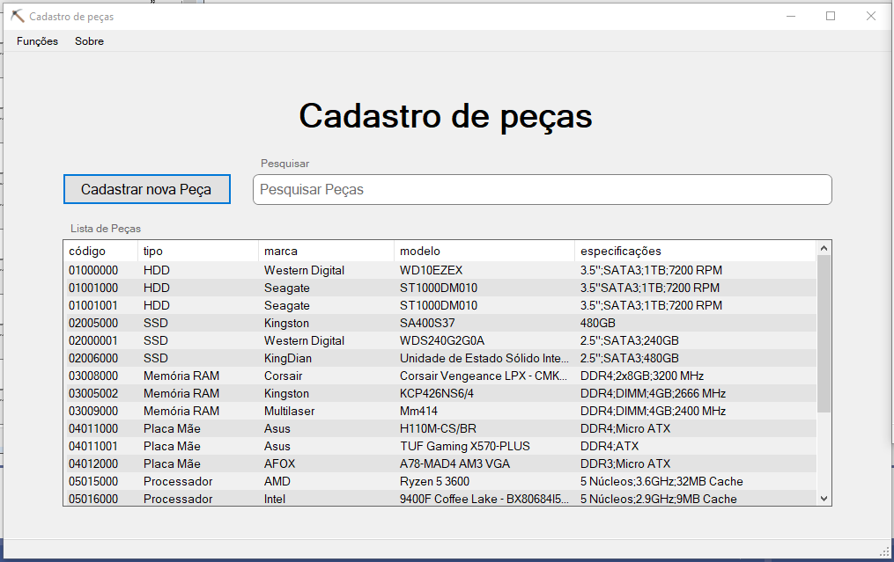
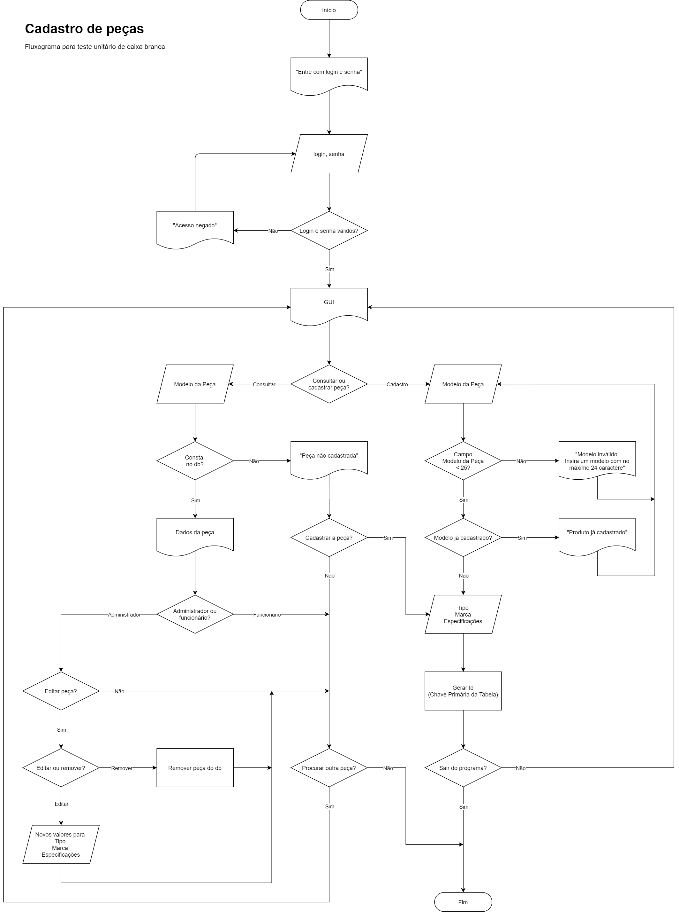
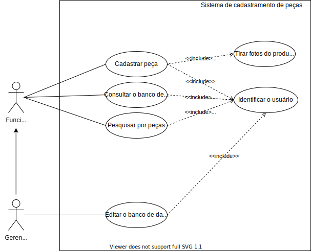

# Sistema de cadastro de peças  ⛏🗻💎

Módulo de cadastro de peças do MRP de uma fabricante de computadores.
Os produtos para produção serão cadastrados em um banco de dados, o usuário deve ser capaz de editar e excluir estes itens, para que posteriormente sejam utilizados por outros módulos do MRP.

## Descrição

Ao iniciar o programa o usuário é apresentado a uma tela de *login*, que invocará o formulário principal caso o funcionário apresente identificação correta.
No formulário de pesquisa de peças, ao inserir os dados no campo “Pesquisar peças cadastradas” a pesquisa é feita automaticamente e uma lista das peças relevantes é criada a partir do banco de dados. 
Ao clicar em cadastrar nova peça é aberto um novo formulário com campos para efetuar o cadastro da nova peça, os campos são Tipo, Marca, Modelo de peça, Largura, Comprimento, Altura e alguns campos de especificações, além de o usuário poder cadastrar até seis fotos da embalagem do produto.
Caso os dados fornecidos estejam na formatação certa o botão de OK se torna ativo, clicando nele é efetuado o cadastro da peça. Ao clicar em Cancelar, os dados são descartados e novamente é aberto o formulário principal, de pesquisa de peças.
Desenvolvido em Windows Forms (.NET 4.7.2).

## Requisitos

### Funcionais

|       |                                                              |
| ----- | ------------------------------------------------------------ |
| RF01: | Como gerente do setor de cadastramento, desejo controlar o acesso por meio de login e senha dos usuários para garantir a integridade do banco de dados. |
| RF02: | Como funcionário do setor de cadastramento, preciso cadastrar novas peças no sistema para que estas se tornem disponíveis para os outros módulos. |
| RF03: | Como gerente do setor de cadastramento, preciso fazer alterações no cadastro dos produtos caso haja erro. |
| RF04: | Como funcionário do setor de cadastramento, preciso garantir que cada produto tenha um único código e que não haja códigos repetidos para que não haja duplicidade no banco de dados. |
| RF05: | Como funcionário do setor de cadastramento, preciso procurar um produto a partir de seus dados (código, tipo, marca, modelo e especificação) para facilitar a localização do produto. |
| RF06: | Como funcionário do setor de cadastramento, preciso cadastrar fotos das 6 faces do produto para facilitar a identificação visual no estoque. |

### Não Funcionais

|       |                    |                                                              |
| ----- | ------------------ | ------------------------------------------------------------ |
| RQ01: | Implementação      | O sistema deve ser desenvolvido em C#.                       |
| RQ02: | Usabilidade        | O sistema deve ter telas similares ao ambiente Windows, tornando a utilização familiar o aprendizado bastante intuitivo, dispensando a necessidade de muitas horas de treinamento. |
| RQ03: | Usabilidade        | O sistema deve exibir texto de orientação caso o usuário tenha dúvidas sobre sua utilização. |
| RQ04: | Usabilidade        | O sistema deve ser responsivo, se adaptando ao tamanho de janela que o usuário escolher |
| RF05: | Usabilidade        | O sistema deve ser também navegado através do teclado, afim de que os usuários tenham mais agilidade na utilização. |
| RQ06: | Segurança          | O sistema deve impedir que usuários não autorizados realizem alterações no banco de dados. |
| RQ07: | Interoperabilidade | Deve ter integração com os sistemas de estoque de peças, vendas e montagem de produto final. |
| RQ08: | Disponibilidade    | O sistema deve permanecer operacional 24 horas por dia, todos os dias da semana, a fim manter a alta disponibilidade do negócio. |
| RQ09: | Manutenibilidade   | O sistema deve ser modularizado a fim de não interromper os serviços de venda e montagem se estiver em manutenção. |
| RQ10: | Confiabilidade     | Planejamento de backup e recuperação de dados, a fim de aumentar os níveis de tolerância a falhas. |

### Restrições

|       |                                                              |
| ----- | ------------------------------------------------------------ |
| RT01: | O custo de manutenção mensal do sistema deverá ser menor ou igual a ½ salário mínimo. |
| RT02: | O prazo de implantação do sistema deve ser até 21/dez.       |
| RT03: | O desenvolvimento do projeto não poderá ultrapassar o custo de R$30.000,00. |

### Casos de Uso

## Sobre
Caleb Araujo de Souza
Cesar Hideki Kimura
Cleber Heck da Silva
Daniel Correa Alves
Ricardo Alves Gomes
Taylan Peixoto da Silva

## Todo

### Funcionalidade

- impedir peças duplicadas
- criar o código da peça no próprio programa
- diferenciar entre funcionarios e administradores

### Interface

- text dummy diferente do texto de label nas especificacoes
- imagens?
- Loadscreen
- Dark Mode???Não...

### Otimização

- remover todas variaveis globais q puder
- resolver o caminho do banco de dados
- criar uma função genérica de spawn
- filtrar sugestoes de marca a partir do tipo (sec_form) (de forma otimizada) (talvez criando uma autocompletesource pra cada tipo de produto no momento do load)
- criar procedures de insert, select, update, delete
- usar classes (feito gente)
- pesquisar funcoes Async
- usar a TextboxCE de mãe da MultilinhaCE e da ComboboxCE