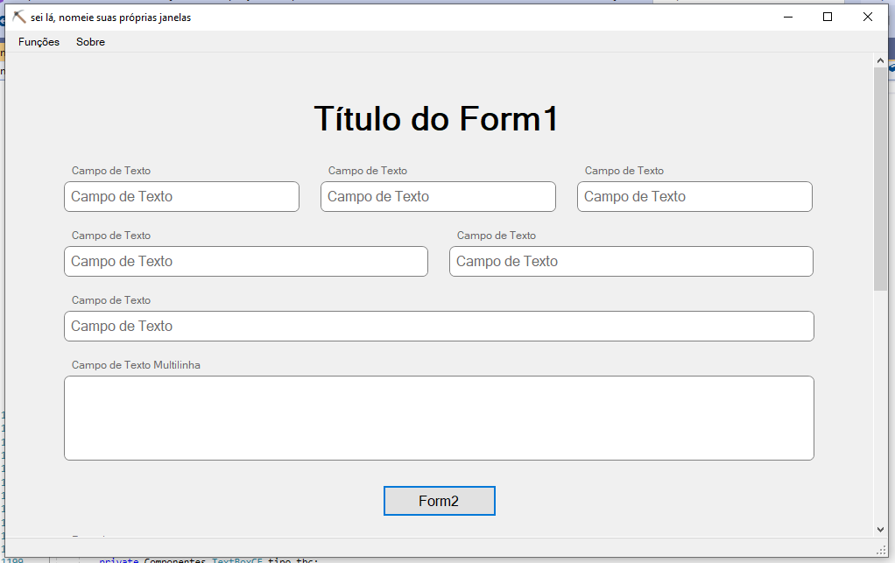
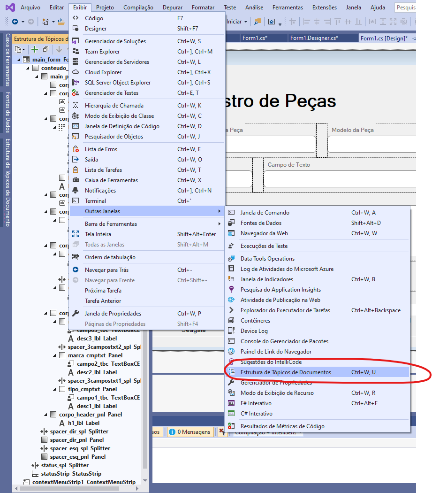
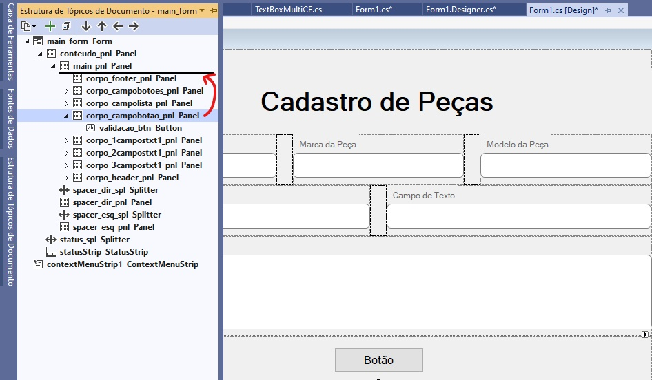
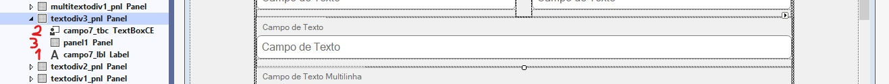
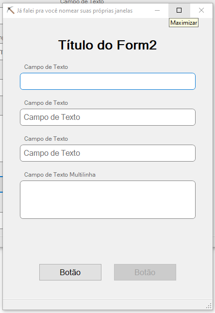
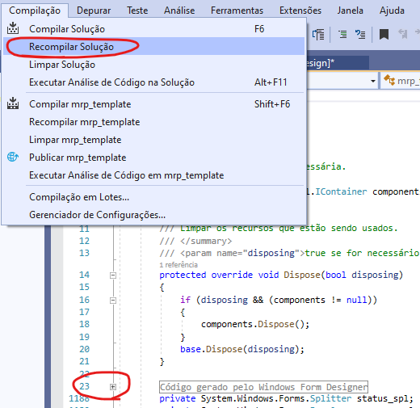

# Guia de estilos do MRP

Guia de estilos de um [MRP](https://pt.wikipedia.org/wiki/Material_Requirement_Planning) pra montadora de computadores (que pode ou não vir a se chamar SacoDeCarvao). Feito pra entregar pra Jane no dia 27, pra todo mundo passar de ano (☭) e principalmente pra evitar diferença no *layout* das diferentes partes do MRP e garantir a padronização das partes.

## Como usar?

Primeira coisa: você já deve ter baixado o .zip de seja lá onde a gente mandou isso, então só o que precisa fazer agora é:
1. Descompactar o arquivo `mrp.zip` onde você preferir
2. Abrir o Visual Studio e escolher `Abrir um projeto ou uma solução`
3. Navegar até a pasta `mrp` (a que contém esse README.md) e escolher o arquivo `mrp_template.sln`
4. Safe

## Estilos
Esse template serve só como guia pra cada grupo desenvolver seu próprio layout, então pode até jogar todo esse projeto fora, com tanto que não hora de criar seu próprio formulário tente respeitar os seguintes preceitos:

### Organização
Os elementos do layout estão **docados**, o que significa que eles aparecem no documento na ordem em que são criados, pra conseguir visualizar e mudar essa ordem você precisa abrir a aba de `Estrutura de Tópicos do Documento` em `Exibir>>Outras Janelas>>Estrutura de Tópicos de Documento`, como na imagem abaixo:

Então se por exemplo, você quiser mover o botão de validação pra baixo da lista de peças, precisa selecionar o painel do qual o botão faz parte e carregar pra cima do painel que contém a lista (lembrando que quanto mais acima na estrutura, mais pra baixo e elemento está na ordem de carregamento).

É difícil de explicar, pera aí...
O formulário é populado por painéis horizontais docados em **Top**, cada um desses painéis vai conter um ou vários elementos do layout, você decide, se for mais de um, então docke em **Left** os elementos dentro desse painel horizontal, esses elementos são por sua vez, também painéis, que contém o elemento em si, eles são organizados como na imagem seguinte:

A label descritiva fica docada em **Top**, o espaçador de baixo docado em **Bottom** e o elemento principal fica como **Fill**, assim eles vão ser capazes de ser redimensionados automaticamente, se quiser mudar a altura de algum elemento, mude sempre no painel horizontal a que ele pertence.

### Nomenclatura
Não sou pai de programador, nomeiem seus objetos como bem entenderem.

### Espaçamento dos elementos
Os espaçadores das extremidades tem originalmente 96 pontos de largura, mas esse tamanho varia entre 32 e 128, dependendo do tamanho da janela.
Os espaçadores do corpo do formulário tem 24 pontos de largura sempre.
header principal: 120 pontos, com o h1 de altura 90 dentro dele, docado **Bottom**.
header secundário: 86 pontos, com o h2 de altura 64 dentro dele, docado **Bottom**.
pelo menos 16 pontos de respiro em cima dos componentes que não comecem com uma label
12 pontos de respiro embaixo dos componentes
se o div começar com uma label, a label deve ter 6 pontos de padding-top e 0 respiro superior (`Dock: Top`)
usar `Dock: Fill` no componente principal da div, com exceção dos botões.
botões não devem ser docados, e deve ter `Anchor: None`
6 pontos de arredondamento nas textboxs
36 pontos de tamanho das textbox e botões

### Tipografia
fonte: Microsoft Sans Serif
títulos: 28 pontos
sub-título: 20 pontos
etiquetas: 9 pontos
campos de texto: 12 pontos
botões: 12 pontos
lista: 10 pontos

### Cores
formulário: SystemColors.Control
texto: SystemColors.ControlText
texto (dummy): SystemColors.GrayText
Azul (elemento selecionado): SystemColors.Highlight
Cinza (elemento fora de foco): Color.Gray
Verde (regularidade no preenchimento): Color.ForestGreen
Vermelho (irregularidade no preenchimento): Color.Red

## Conteúdo do projeto

### Form1.cs
O formulário principal. O código do template está, em sua maioria, no arquivo `Form1.cs`, então se for mudar algo, procure lá primeiro.

### Form2.cs
Formulário secundário, ele tem a mesma responsividade do Form1, mas é menos complexo, provavelmente usar pra cadastros ou validações. Pra efeito de demonstração, o botão Form2 do formulário principal abre o Form2.

### /Componentes/

| componente            | descrição  |
|---|---|
| `ListaView.cs`        | Classe que permite à listview ser organizada por ordem alfabética por coluna, função que você esperaria que existisse no windows forms, mas não. * |
| `TextBoxCE.cs`        | A caixa de texto com bordas arredondadas, dá pra fazer várias coisas que uma textbox normal não permite, como colorir as bordas.  |
| `TextBoxMultiCE.cs`   | Igual à caixa de cima, com a única diferença que esta é multilinha, ia juntar as duas em um único objeto, mas faltou ciência.  |
| `RectCE.cs`           | É a parte exterior da TextBoxCE, não precisa se preocupar com essa classe.  |
| `Transform.cs`        | Outra parte da TextBoxCE, não sei bem o que ela faz... só copiei o código do StackOverflow, se descobrir avise. |
| `TextBoxSdC.cs`       | Mais uma versão de caixa de texto, essa é bem mais simples, em todos os sentidos da palavra. |

* A ListaView também é colorida e dimensionada programaticamente, (porque o Forms não ajuda em nada mesmo) então se mudar o nome de alguma coluna, ou a quantidade de colunas, lembre de mudar também a função de `RedimensionaPainelMeio()` no `Form1.cs`.

## Panik
Se você estiver editando o código de seu projeto e quando tentar voltar pro design o Visual Studio indicar erro, não entre em pânico, abra o arquivo `Form1.Designer.cs`, expanda o '+' da linha 23 e procure por algum erro lá, se achar que já corrigiu o problema e mesmo assim o Visual Studio indicar erro tente recompilar o projeto em `Compilação>>Recompilar Solução`, ou o bom e velho fechar e abrir o documento.

## Não gostou? Faz melhor
Qualquer dúvida sobre o design, problema, ou sugestão de mudanças, ou se você tiver uma ideia diferente do que deve ser feito, só mandar mensagem pra Ricardo ou Vitor no whatsapp e respondemos ... no mesmo dia? ... talvez.

PS. Saudades do CSS, sem mais.